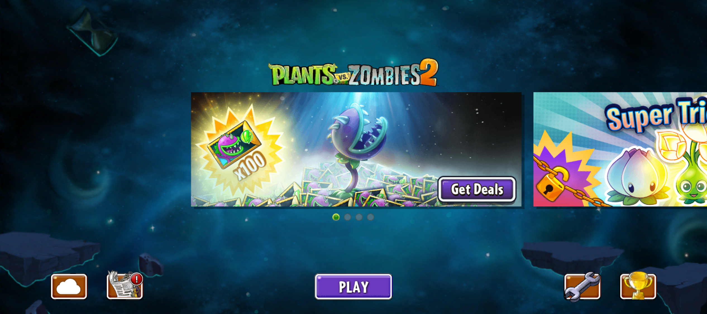
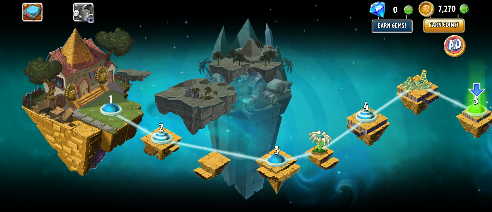
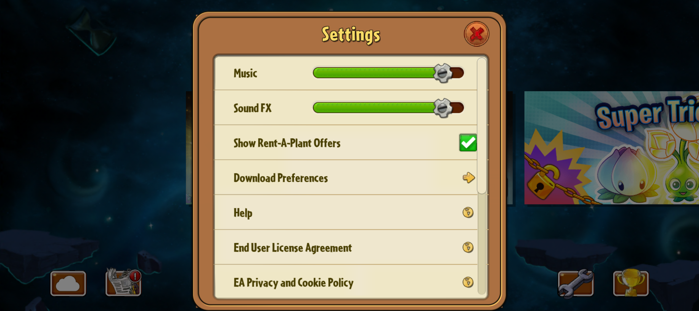
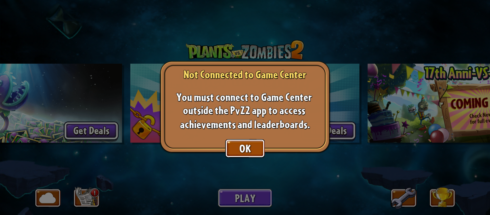
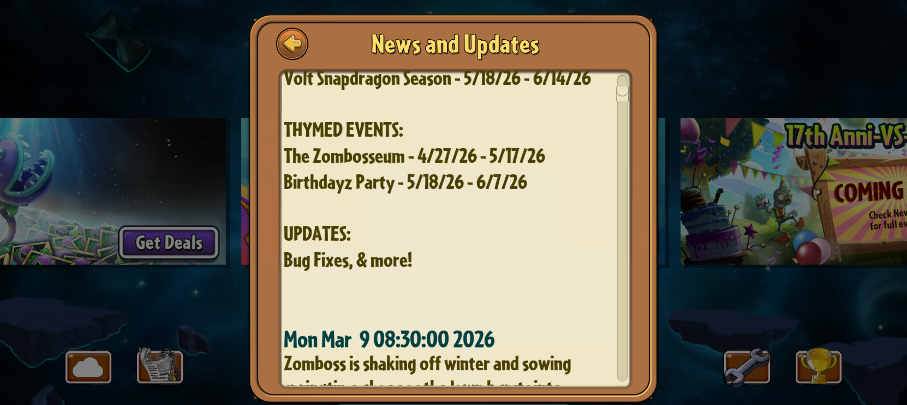
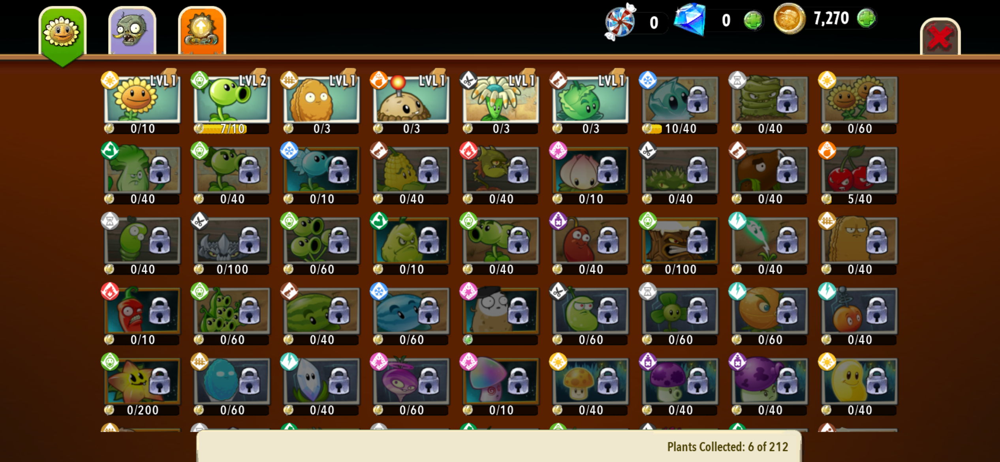
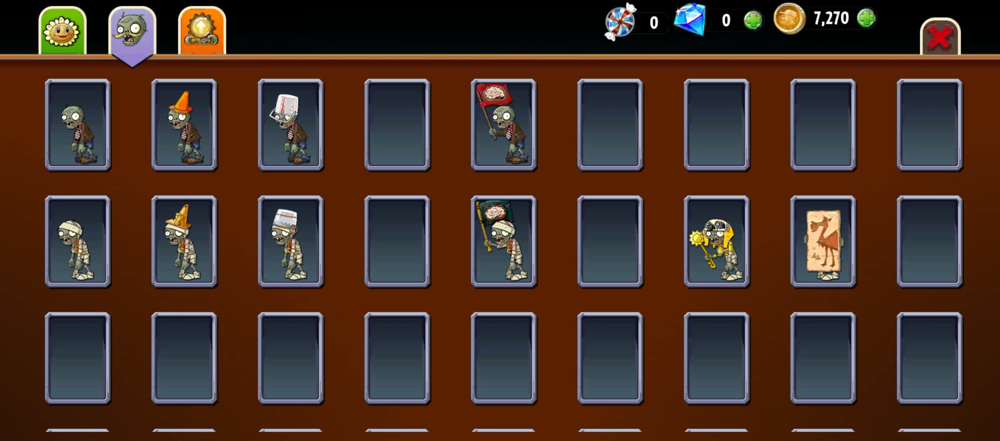

# ورود، ثبت‌نام، ساخت کاربر و پروفایل <!-- {#menu-auth-profile} -->

**مسئول: محمدپارسا**

- جریان کامل ورود و ثبت‌نام، اعتبارسنجی‌ها، پیام خطاها و بازیابی حساب مشخص شود.
- مراحل ساخت کاربر جدید و پروفایل اولیه (نام، تصویر، تنظیمات پایه) توضیح داده شود.
- ارتباط این بخش با دسترسی به منوها و ذخیره‌سازی وضعیت کاربر مستند شود.

### منوها (Menus)
در داخل بازی، منوها برای دسترسی کاربر به بخش‌های مختلف بازی مانند نقشه، تنظیمات،‌ فضای کاربری و ... توسعه می‌یابند. دستورات زیر در همه منو‌ها قابل استفاده هستند:

#### ورود به منو
کاربر در هر منو که باشد، قادر خواهد بود به منوهای خاصی برود:
- منوی ثبت‌نام:‌ منوی ورود.
- منوی ورود:‌ تنها با ورود به اکانت قادر خواهد بود به منوی اصلی برود.
- منوی اصلی: منوی بازی، منوی تنظیمات، منوی شبکه، منوی اخبار، منوی پروفایل
-  منوی بازی:‌ منوی کلکسیون
```
menu enter <menu_name>
```
#### منوی فعلی
```
show current menu
```
#### خروج از منو
کاربر با خروج از منو، به شرح زیر به منوی دیگری باید هدایت شود:
- منوی ثبت‌نام: پایان برنامه
- منوی ورود: منوی ثبت‌نام
- منوی اصلی: برای خروج از منوی اصلی باید از طریق دستور `logout` که در ادامه توضیح داده می‌شود، باید اقدام شود.
- منوی بازی، منوی تنظیمات، منوی شبکه، منوی اخبار، منوی پروفایل: منوی اصلی
- منوی کلکسیون:‌ منوی بازی
```
menu exit
```


در ادامه به توضیح انواع منوهایی که باید پیاده‌سازی شوند میپردازیم:
## منوی ثبت‌نام (Register Menu)

بازی از این منو شروع می‌شود. در این قسمت با توجه به اینکه کاربر قبلا حساب کاربری دارد یا نه، میتواند یکی از گزینه‌های زیر را انتخاب کند:
#### ۱. کاربر  ثبت‌نام جدید (Register) انجام دهد. 

در این قسمت کاربر را وارد کردن اطلاعات زیر در همان منو (با قوانین اعتبارسنجی هر کدام)، یک حساب کاربری جدید برای خود می‌سازد: 
1. نام کاربری (Username)
2. رمز عبور (Password) و تکرار آن (Password_Confirm)
3. نام مستعار (Nickname)
4. ایمیل (Email)
5. جنسیت (gender)

```
register -u <username> -p <password> <password_confirm> -n <nickname> -e <email> -g <gender>
```

##### ۱. نام کاربری (Username)
نام کاربری برای شناسایی حساب کاربری در سطح بازی است. نام کاربری تنها می‌تواند شامل **حروف کوچک و بزرگ، اعداد و نماد -** باشد.
###### خطاها
* **نام کاربری تکراری**: نام کاربری نباید از قبل در سامانه موجود باشد. در این حالت شما باید به اضافه کردن اعداد تصادفی یا - به نام کاربری وارد شده، یک نام کاربری جدید بسازید و در صورت تایید توسط کاربر از آن استفاده کنید.
##### ۲. رمز عبور (Password)
در رمز عبور، تنها مجاز به استفاده از **حروف کوچک و بزرگ، اعداد و نمادهای خاص** هستید.
###### خطاها
* **رمز عبور ضعیف**: در صورت قوی نبودن رمز عبور، علاوه بر نمایش خطا باید دلیل‌ آن را نیز ذکر کنید. **رمز عبور قوی** است که طول آن حداقل ۸ حرف باشد،‌ از حروف کوچک و بزرگ، اعداد و نمادهای خاص نیز در آن استفاده شده باشد. (نمادهای خاص:‌ `? > < , " ' ; : \ / | [ ] } { + = ( ) * & ^ % $ # !`)
* **عدم تطابق رمز عبور و تکرار آن**: در این صورت از کاربر خواسته شود که دوباره رمز عبور را وارد کند یا به منوی اولیه برگردد. کاربر می‌تواند در صورت اشتباه چندبار رمز عبور را وارد کند.

**رمز عبور تصادفی**: کاربر می‌تواند به جای وارد کردن رمز عبور و تکرار آن از رمز عبور تصادفی استفاده کند، در این صورت شما باید یک رمز عبور تصادفی که تمام معیارهای یک رمز عبور قوی را داراست، تولید کنید و در صورت تایید کاربر آن را به عنوان رمز عبور استفاده کنید. در غیر این صورت، به انتخاب کاربر یا رمز عبور جدید تولید کنید یا به منوی اولیه بازگردید.


<div style="background-color: #261c33; border: 1px solid #b266ff; color: white; padding: 15px; border-radius: 8px; font-family: Tahoma, sans-serif; direction: rtl;">
    <strong style="color: #b266ff; font-size: 1.1em;">⭐ نکته امتیازی</strong>
    
    <!-- به‌جای تگ p از div استفاده شد تا بتواند پاراگراف‌ها و لیست‌ها را درون خود جای دهد -->
    <div style="margin-top: 15px; line-height: 1.8; text-align: justify;">
        
        <strong style="color: #e0b3ff;">بخش امتیازی: SHA-256</strong>
        <p style="margin-top: 5px;">
        الگوریتم SHA-256 (مخفف Secure Hash Algorithm 256-bit) یک تابع هش رمزنگاری‌شده‌ی یک‌طرفه است که هر ورودی دلخواه (مانند رمز عبور) را به خروجی‌ای با طول ثابت ۲۵۶ بیت تبدیل می‌کند. این الگوریتم به‌گونه‌ای طراحی شده که بازیابی مقدار اولیه از خروجی تولیدشده عملاً غیرممکن باشد.
        </p>
        
        <strong style="color: #e0b3ff;">علت استفاده از رمزنگاری یک‌طرفه</strong>
        <p style="margin-top: 5px;">
        رمزنگاری یک‌طرفه برای حفاظت از اطلاعات حساس (مانند رمز عبور) طراحی شده است تا حتی در صورت دسترسی غیرمجاز به فایل‌های ذخیره‌سازی، امکان بازیابی رمز اصلی وجود نداشته باشد. در این روش، رمز عبور کاربران هنگام ذخیره‌سازی، هش می‌شود و هنگام ورود مجدد، تنها خروجی هش‌شده‌ی رمز واردشده با مقدار ذخیره‌شده مقایسه می‌گردد.
        </p>
        
        <p>
        پیاده‌سازی رمزهای عبور با استفاده از الگوریتم‌هایی مانند SHA-256، امنیت سیستم را به‌طور قابل توجهی افزایش داده و از افشای مستقیم اطلاعات کاربران جلوگیری می‌کند. انجام این پیاده‌سازی برای رمز عبور کاربران، به‌عنوان یک بخش امتیازی در ارزیابی در نظر گرفته شده است.
        </p>
        
        <p>
        ذخیره‌سازی اطلاعات کاربران باید به‌صورت فایل خارجی انجام شود تا در هنگام اجرای مجدد برنامه، اطلاعات قبلی بازیابی شده و در دسترس باشد. این فرآیند شامل موارد زیر است:
        </p>
        
        <ul style="margin-bottom: 0;">
            <li>ذخیره‌سازی کلیه کاربران ثبت‌نام‌شده به‌همراه اطلاعات آن‌ها</li>
            <li>بازیابی خودکار اطلاعات کاربران در شروع اجرای برنامه</li>
            <li>عدم نیاز به ثبت‌نام مجدد کاربران قبلی پس از بسته‌شدن برنامه</li>
        </ul>
        
    </div>
</div>

<br>
<div style="background-color: #f0f7ff; border: 1px solid #4a90e2; color: #333333; padding: 15px; border-radius: 8px; font-family: Tahoma, sans-serif; direction: rtl;">
    
    <strong style="color: #4a90e2; font-size: 1.1em;">💡 پیشنهاد فنی</strong>
    
    <p style="margin-bottom: 0; line-height: 1.8; margin-top: 10px; text-align: justify;">
برای پیاده‌سازی این قابلیت، می‌توان از قالب‌هایی مانند <strong>JSON یا XML</strong> برای ذخیره‌سازی داده‌ها به‌صورت ساختاریافته استفاده کرد. همچنین فایل خروجی می‌تواند با پسوند <code>txt.</code> یا <code>json.</code> ذخیره شود. در پروژه‌های پیشرفته‌تر، امکان استفاده از پایگاه داده‌های سبک مانند <strong>SQLite</strong> نیز وجود دارد.
    </p>

</div>

##### ۳. نام مستعار (Nickname)
این نام به عنوان **نام نمایشی** (Display Name) باید استفاده شود.
###### خطاها
* **طول غیر مجاز**: حداقل طول باید ۳ کاراکتر و حداکثر باید ۳۰ کاراکتر باشد.
##### ۴. ایمیل (Email)
ایمیل شما باید از قوانین اعتبارسنجی زیر پیروی کند، در غیر این صورت باید خطای مربوطه را به کاربر نمایش دهید:
1. ایمیل باید شامل **یک و فقط یک** نماد `@` باشد.
2. ایمیل باید دارای یک **نام کاربری معتبر** در بخش قبل از `@` باشد:
	* فقط شامل حروف انگلیسی (`A-Z`, `a-z`)، اعداد (`0-9`)، نقطه (‍‍`.`)، خط تیره (‍`-`)، و آندرلاین‌(‍`_`) باشد.
	* با حرف یا عدد شروع و پایان یابد.
	* نقطه (‍‍`.`) نباید دو بار پشت سر هم بیاید.
3. بخش **دامنه** (بعد از `@`) باید:
	- شامل حداقل یک نقطه (`.`) باشد.
	- پسوند دامنه (مثل `com` ، `.org`، `.ir.`) باید حداقل دو حرف باشد.
	- فقط شامل حروف انگلیسی (`A-Z`، `a-z`)، اعداد (`0-9`)، خط تیره (`-`) باشد.
	- با حرف یا عدد شروع و پایان یابد.
4. ایمیل نباید شامل **نمادهای غیرمجاز** مانند:
	`? > < , " ' ; : \ / | [ ] } { + = ( ) * & ^ % $ # !`
	باشد.

###### مثال‌های نامعتبر
- `john..doe@example.com` (دو نقطه پشت سر هم)
- `user@domain` (پسوند دامنه ندارد)
- `user@domain.c` (پسوند یک حرفی نامعتبر است)
- `user@domain..com` (نقطه‌های دوتایی در دامنه)
- `user@.com` (دامنه با نقطه شروع شده)
##### ۵. جنسیت (Gender)
این بخش توضیحات بیشتری ندارد.<br><br>


پس از بررسی تمام خطاهای بالا، در صورت وجود هر گونه خطا هیچ عملیاتی نباید انجام شود و منتظر دستور بعد کاربر می‌مانیم. در صورتی که هیچ‌گونه خطایی رخ نداد لیست سوالات امنیتی به کاربر نشان داده شده و کاربر می‌تواند یک پرسش امنیتی را به دلخواه انتخاب کند. توجه شود که لیست سوالات امنیتی توسط خود شما تعیین می‌شود و در بازی قرار داده می‌شود.

```
pick question -q <question_number> -a <answer> -c <answer_confirm>
```


در انتها کاربر با ایجاد حساب کاربری جدید،‌ به منوی ورود (Login Menu) هدایت می‌شود تا از آنجا بتواند با وارد کردن حساب کاربری خود، وارد منوی اصلی بازی شود.


#### ۲. گزینه Login Menu انتخاب شود.
در این قسمت، با زدن دکمه Login menu، کاربر بایستی به منوی ورود انتقال یابد.
در فاز ۱، کاربر با دستور **ورود به منو** می‌تواند به **منوی ورود** برود.
<br>


## منوی ورود (Login Menu)
در این قسمت می‌تواند یکی از اقدامات زیر را انجام دهد:
#### ۱. وارد کردن اطلاعات جهت ورود به حساب کاربری
در این حالت، کاربران می‌توانند با وارد کردن نام کاربری و رمز عبور خود وارد منوی اصلی برنامه شوند. 
* در صورت نبودن نام کاربری وارد شده در سیستم و یا صحیح نبودن رمز عبور وارد شده، نیاز است تا پیغام خطای مناسب نمایش داده شود.
*  در این قسمت باید گزینه‌ای برای حالت`Stay logged in‍` قرار داده شود. این قابلیت زمانی استفاده می‌شود که کاربر اگر بازی را نیز ببندد و مجدد باز کند،‌ همچنان در حال `logged in` که از پیش قرار داشت‌، بماند.

```
login -u <username> -p <password> -stay-logged-in
```

#### ۲. گزینه فراموشی رمز عبور
کاربر می‌تواند در این بخش با وارد کردن نام کاربری خود و پاسخ دادن به پرسش‌های امنیتی که در حساب کاربری ذخیره شده، یک کلمه عبور جدید برای خود انتخاب کند که می‌تواند تصادفی یا انتخابی باشد.

```
forget password -u <username> -e <email>
```

```
answer -a <answer>
```

در ادامه  اگر جواب درست بود به صورت خودکار پیغام داده شود که رمز عبور جدید را وارد کنید و اگر پاسخ درست نبود هم به اول منو بازگردد. توجه کنید که در این بخش هم مانند منوی ثبت‌نام در صورت نیاز لازم است تا پیغام خطای مناسب نمایش داده شود.

<br>


## منوی اصلی (Main Menu)
بعد از انجام مراحل Authorization/Authentication و زمانی که کاربر توانست با یک حساب کاربری شناخته شود، وارد منوی اصلی می‌شویم.




این منوی ارتباط اصلی ما را دیگر منوهای بازی برقرار میکند. از این منو میتوان با انتخاب گزینه آنها به یکی از منوهای زیر رفت:
* منوی بازی (Adventure Menu) که با دکمه Play داخل صفحه بالا نشان داده شده است.
* منوی تنظیمات (Settings Menu)
* منوی شبکه (Game Center Menu) -- برای فاز شبکه
*  منوی اخبار (News Menu)
* منوی پروفایل (Profile Menu) که این منو در صفحه بالا مشخص نیست ولی باید پیاده سازی شود.

#### خروج کاربر
با اعمال این دستور، کاربر از حساب کاربری خود خارج و وارد منوی ثبت‌نام خواهد شد.

```
user logout
```


همانطور که در عکس بالا هم مشخص است، کاربر با انتخاب یکی از این منوها به منوی مربوطه خواهد رفت.

## منوی بازی (Adventure Menu)




در این منو، چند قسمت (Chapter) وجود دارد که هر زمان تمام مراحل آن Chapter تمام شد، مراحل Chapter بعد باز می‌شوند. با انتخاب هر Chapter وارد قسمت بازی می‌شوید و شروع به بازی کردن با آن مرحله از بازی خواهید شد.

در قسمت بالای صفحه‌ هم، المان‌های مختلفی وجود دارد.
* دکمه منوی کلکسیون (Collection Menu). (در فاز ۱، با دستور `menu enter` باید بتوان به این منو رفت.)
* دکمه گلخونه (greenhouse).
```
greenhouse
```
* نشان‌دهنده میزان سکه جمع‌آوری شده (!)
```
coin wallet
```
* نشان‌دهنده میزان الماس جمع‌آوری شده‌ (!)
```
gem wallet
```

هنگامی که هر Chapter یا مرحله را به سرانجام رساندید، Chapterها و مراحل جدید برای شما باز می‌شوند و می‌توانید آنها را ادامه دهید ولی در غیر این صورت آنها هنوز باز (Unlock) نشده‌اند.

**نکته**: همچنین بایستی گزینه جا‌بجا شدن بین دنیاهای مختلف بازی هم در این منو قرار داده شود.

## منوی تنظیمات (Settings Menu)




در این منو،‌ می‌توان تنظیمات مربوط به بازی از جمله میزان سختی بازی و ... را تغییر داد.
در ادامه به دستوراتی که در این فاز بایستی توسط کاربر پیاده‌سازی شوند می‌پردازیم:
- میزان سختی بازی (که مقدار `difficulty level` باید مقداری بین ۱ تا ۵ باشد. وقتی حساب کاربری جدید ساخته می‌شود، به صورت پیش‌فرض میزان سختی روی مقدار ۳ است.)

```
change difficulty -l <difficulty_level>
```
<br>

<div style="background-color: #2b241f; border: 1px solid #f5894b; color: white; padding: 15px; border-radius: 8px; ont-family: Tahoma, sans-serif; direction: rtl; ">
    
    <strong style="color: #f5894b;">⚠️ تذکر</strong>
    
    <p style="margin-bottom: 0; line-height: 1.6;">
در بخش‌های بعدی پروژه، تنظیمات جدید مطابق با خودش بخش به این قسمت اضافه خواهد شد.
    </p>

</div>

<br>

## منوی شبکه (Game Center Menu)



توضیحات بیشتر درباره این منو در داک قسمت شبکه ارائه داده خواهد شد.


## منوی اخبار (News Menu)



این منو مربوط به اخبار بازی است. مانند زامبی‌ها، گیاهان، minigameها، پیام از طرف سایر کاربران (داخل قسمت شبکه) و سایر موارد که در داخل بازی اتفاق می‌افتد، در این بخش قرار میگیرند. هرگاه پیام جدیدی برای کاربر قرار داده شود، باید دکمه News داخل منوی اصلی، باید یک علامت قرمز رنگی برای اطلاع کاربر قرار داده شود.
در ادامه به توضیح بیشتر مواردی که باید در این بخش پیاده‌سازی کنید می‌پردازیم.
1. هرگاه یک گیاه جدید توسط کاربر باز (Unlock) شود.
2. هرگاه یک زامبی جدید در مرحله بازی شده برای کاربر باز (Unlock) شود.
3. هرگاه مراحل جدید یا minigameهای جدید توسط کاربر باز (Unlock) شود.
4. در فازهای بعدی گرافیک و شبکه، اطلاعات جدید هم داخل این قسمت جهت اطلاع کاربر از وضعیت بازی یا سایر کاربران باید پیاده‌سازی شود که در آن قسمت توضیح داده خواهد شد.

#### نمایش اخبار جدید
```
show unread news
```
در این صورت بایستی این اخبار **خوانده شده** در نظر گرفته شوند و در دفعات بعدی اجرای این کد، این اخبار نشان داده نشوند.
#### نمایش تمام اخبار کاربر
```
show all news
```


## منوی پروفایل (Profile Menu)

در این منو، کاربر بایستی بتواند تغییرات مربوط به حساب کاربری خود، شامل موارد زیر را تغییر دهد:
* تغییر username:‌ در صورتی که با نام کاربری فعلی برابر باشد، باید خطای متمایز و مناسب نشان دهد.
```
change username -u <username>
```
* تغییر nickname: در صورتی که با نام مستعار فعلی برابر باشد، باید خطای متمایز و مناسب نشان دهد.
```
change nickname -u <nickname>
```
* تغییر email: در صورتی که با ایمیل فعلی برابر باشد، باید خطای متمایز و مناسب نشان دهد.
```
change email -e <email>
```
* تغییر password: در صورتی که مقدار گذرواژه جدید با گذرواژه کنونی کاربر یکسان باشد یا در صورتی که گذرواژه قدیمی اشتباه باشد، در هر حالت باید اخطاری متناسب با آن چاپ شود.
```
change password -p <new_password> -o <old_password>
```

<div style="background-color: #2b241f; border: 1px solid #f5894b; color: white; padding: 15px; border-radius: 8px; ont-family: Tahoma, sans-serif; direction: rtl; ">
    
    <strong style="color: #f5894b;">⚠️ تذکر</strong>
    
    <p style="margin-bottom: 0; line-height: 1.6;">
برای تغییر هر یک از موارد بالا، بایستی کاربر طبق همان محدودیت‌ها و مراحلی که در مرحله Register برای این اطلاعات در نظر گرفته شده بود، اقدام کند.
    </p>

</div>


#### نمایش اطلاعات کاربر
با وارد کردن این دستور، باید اطلاعات کاربر شامل موارد زیر نمایش داده شود:
- نام کاربری (Username)
- نام مستعار (Nickname)
- بالاترین پول کسب شده در یک بازی
- تعداد بازی‌های انجام شده
- میزان سکه‌های کسب شده کاربر
- میزان الماس‌های کسب شده کاربر
- تعداد مراحلی که کاربر آنها را گذرانده است.

```
user info
```

## منوی کلکسیون (Collection Menu)




همانطور که در این عکس‌ها هم مشاهده می‌کنید، منوی Collection برای نشان دادن گیاهان، زامبی‌هایی که کسب کرده‌اید، استفاده می‌شوند.
در این قسمت، با کلیک کردن روی هر گیاه یا زامبی باید جزئیات آن مشاهده کنیم.
هر زامبی را تا زمانی که داخل فضای بازی ندیده باشیم، داخل این قسمت وجود ندارند و قاب مربوط به آنها خالی هست.

#### نمایش لیست گیاهان کسب شده
```
show collected plants
```
#### نمایش لیست تمام گیاهان تعریف شده در بازی
```
show all plants
```
#### نمایش لیست زامبی‌های مشاهده‌شده
```
show revealed zombies
```
#### نمایش لیست تمام زامبی‌های تعریف شده در بازی
```
show all zombies
```
#### نمایش مشخصات یک گیاه
```
show plant -p <plant_name>
```
در صورتی که گیاه نام برده هنوز کسب نشده، باید خطای مناسب نشان داده شود.
#### نمایش مشخصات یک زامبی
```
show zombie -z <zombie_name>
```
در صورتی که زامبی نام برده شده هنوز مشاهده‌ نشده، باید خطای مناسب نشان داده شود.