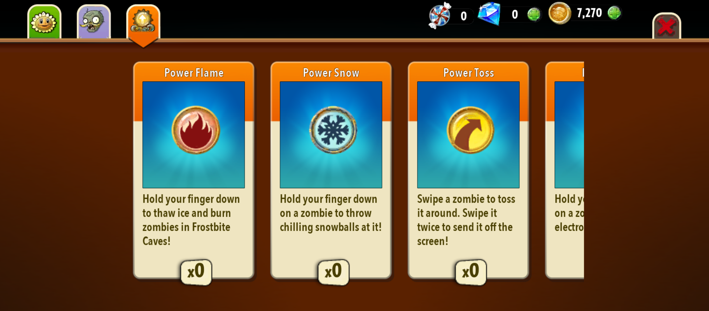

# ورود، ثبت‌نام، ساخت کاربر و پروفایل {#menu-auth-profile}

**مسئول: محمدپارسا**

- جریان کامل ورود و ثبت‌نام، اعتبارسنجی‌ها، پیام خطاها و بازیابی حساب مشخص شود.
- مراحل ساخت کاربر جدید و پروفایل اولیه (نام، تصویر، تنظیمات پایه) توضیح داده شود.
- ارتباط این بخش با دسترسی به منوها و ذخیره‌سازی وضعیت کاربر مستند شود.

در ادامه به توضیح انواع منوهایی که باید پیاده‌سازی شوند میپردازیم:
## منوی ورود/ثبت‌نام (Login/Register Menu)

بازی از این منو شروع می‌شود. در این قسمت با توجه به اینکه کاربر قبلا اکانتی دارد یا نه، میتواند یکی از گزینه‌های زیر را انتخاب کند:
#### گزینه Login انتخاب شود.

#### گزینه Register انتخاب شود.

#### گزینه Forget Password انتخاب شود.

بعد از انجام مراحل Authorization/Authentication و زمانی که کاربر توانست با یک اکانت شناخته شود، وارد منوی اصلی می‌شویم.
## منوی اصلی (Main Menu)

این منوی ارتباط اصلی ما را دیگر منوهای بازی برقرار میکند. از این منو میتوان با انتخاب گزینه آنها به یکی از منوهای زیر رفت:
* منوی بازی (Adventure Menu) که با دکمه Play داخل صفحه بالا نشان داده شده است.
* منوی تنظیمات (Settings Menu)
* منوی شبکه (Game Center Menu)
*  منوی اخبار (News Menu)
* منوی پروفایل (Profile Menu) که این منو در صفحه بالا مشخص نیست ولی باید پیاده سازی شود.

    
    <strong style="color: #f5894b;">⚠️ تذکر</strong>
    
    

لازم به تذکر است که باید گزینه‌ای جهت خروج از منوی اصلی (logout شدن کاربر) و ورود به منوی ورود/ثبت‌نام هم وجود داشته باشد.
    

همانطور که در عکس بالا هم مشخص است، کاربر با انتخاب یکی از این منوها به منوی مربوطه خواهد رفت.

## منوی بازی (Adventure Menu)

در این منو، چند قسمت (Chapter) وجود دارد که هر زمان تمام مراحل آن Chapter تمام شد، مراحل Chapter بعد باز می‌شوند. با انتخاب هر Chapter وارد قسمت بازی می‌شوید و شروع به بازی کردن با آن مرحله از بازی خواهید شد.

در قسمت بالای صفحه‌ هم، المان‌های مختلفی وجود دارد.
* دکمه منوی کلکسیون (Collection Menu).
* نشان‌دهنده میزان سکه جمع‌آوری شده (!)
* نشان‌دهنده میزان الماس جمع‌آوری شده‌ (!)

هنگامی که هر Chapter یا مرحله را به سرانجام رساندید، Chapterها و مراحل جدید برای شما باز می‌شوند و می‌توانید آنها را ادامه دهید ولی در غیر این صورت آنها هنوز باز (Unlock) نشده‌اند.

## منوی تنظیمات (Settings Menu)

در این منو،‌ می‌توان تنظیمات مربوط به بازی از جمله صدا،‌ SFX و ... را تغییر داد.

## منوی شبکه (Game Center Menu)

توضیحات بیشتر درباره این منو در داک قسمت شبکه ارائه داده خواهد شد.

## منوی اخبار (News Menu)

این منو مربوط به اخبار بازی است. مانند زامبی‌ها، گیاهان، minigameها، پیام از طرف سایر کاربران (داخل قسمت شبکه) و سایر موارد که در داخل بازی اتفاق می‌افتد، در این بخش قرار میگیرند.

## منوی پروفایل (Profile Menu)

در این منو، کاربر بایستی بتواند تغییرات مربوط به اکانت خود، شامل موارد زیر را تغییر دهد:
* تغییر username
* تغییر nickname
* تغییر email
* تغییر password 

    
    <strong style="color: #f5894b;">⚠️ تذکر</strong>
    
    

برای تغییر هر یک از موارد بالا، بایستی کاربر طبق همان محدودیت‌ها و مراحلی که در مرحله Register برای این اطلاعات در نظر گرفته شده بود، اقدام کند.
    

همچنین، در این قسمت باید اطلاعات زیر هم قابل نمایش باشند:
* میزان سکه‌های کسب شده کاربر
* میزان الماس‌های کسب شده کاربر
* تعداد مراحلی که کاربر آنها را گذرانده است.

## منوی کلکسیون (Collection Menu)

همانطور که در این عکس‌ها هم مشاهده می‌کنید، منوی Collection برای نشان دادن گیاهان، زامبی‌ها و قدرت (Power)هایی که کسب کرده‌اید، استفاده می‌شوند.

