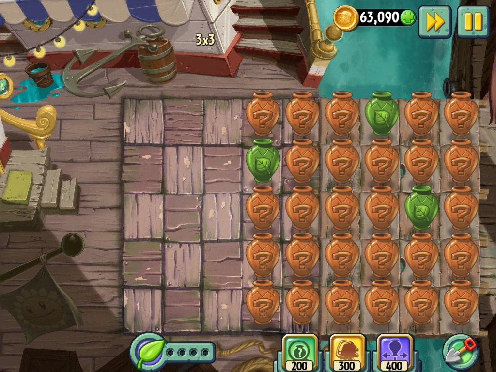
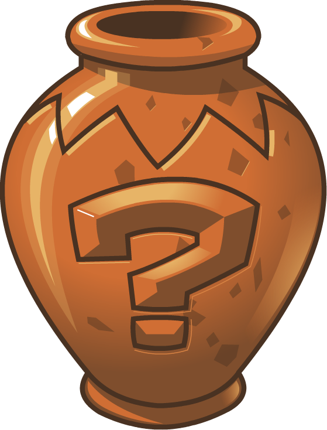
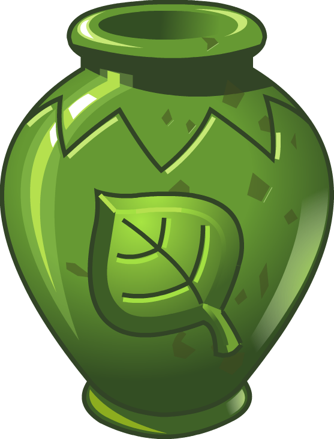
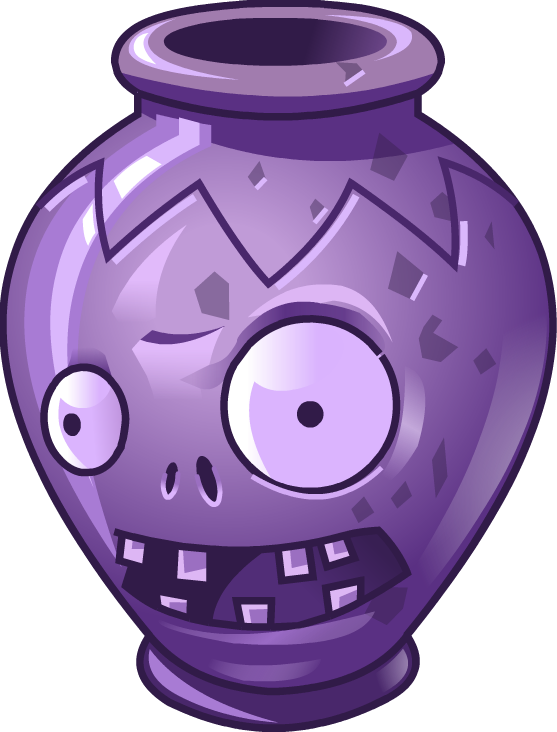
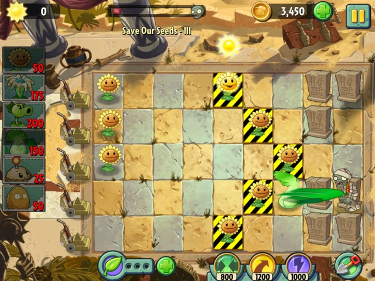
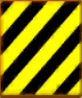

# مینی‌گیم‌ها {#minigames}

**مسئول: امین**

- در فاز فعلی، 3 تا 4 مینی‌گیم از بازی اصلی انتخاب و معرفی شوند.
- برای هر مینی‌گیم، قوانین، هدف و مکانیزم اصلی توضیح داده شود.
- در صورت سبک بودن بار پروژه، امکان افزودن مینی‌گیم‌های بیشتر در فاز بعدی در نظر گرفته شود.

## Vasebreaker (کوزه شکنی) ❓

### معرفی مینی گیم

در این مینی گیم، هدف بازیکن این است که تمامی کوزه های چیده شده روی حیاط خودش را بشکند و هم زمان مراقب باشد که زامبی هایی که ممکن است درون کوزه بوده باشند، مغز او را نخورند.

### جزئیات پیاده سازی

در این مینی گیم، بازیکن گیاهان خودش را انتخاب نمی کند، همچنین خورشید از آسمان نمی افتد و تنها منبع تولید زامبی ها و گیاهان از کوزه هاست. هر کوزه می تواند یا خالی باشد، یا حاوی یک زامبی باشد و یا دارای یک Seed Packet یک بار مصرف برای یک گیاه باشد. لازم به ذکر است که Seed Packet های انداخته شده روی زمین پس از مدتی ناپدید می شوند و بازیکن باید سریعتر برای کاشتن آنها اقدام نماید.

#### کوزه های خاص

علاوه بر کوزه های عادی که صرفا دارای یک نماد علامت سوال هستند، دو نوع کوزه خاص هم داریم.

- کوزه گیاه: به صورت تضمینی یک Seed Packet تصادفی برای کاشت گیاه می دهد.
- کوزه غول: به صورت تضمینی یک غول  (Gargantuar) از آن خارج می شود.

## Save Our Seeds (S.O.S) 🌱

### معرفی مینی گیم

در این مینی گیم، روال بازی تقریبا بدون تغییر است به استثنای یک مورد، تعدادی گیاه از پیش مشخص شده روی حیاط قرار دارند (روی کاشی هایی که رنگ سیاه و زرد دارند قرار می گیرند) و اگر  حتی یکی از این گیاهان خورده یا نابود بشود، بازیکن مرحله را می بازد.

### جزئیات پیاده سازی

روند کلی بازی به طور عمومی حفظ شده و فقط این گیاهان مورد مراقبت به صفحه بازی افزوده می شوند، امکان برداشتن آنها با بیل هم ممکن نیست.

## Wallnut Bowling (بولینگ گردویی) 🎳

### معرفی مینی گیم

در این مینی گیم، بازیکن حق انختاب گیاهان خودش را ندارد و گیاهان از طریق نوار (Conveyor Belt) به بازیکن داده می شود. این گیاهان گردو هایی هستند که پس از کاشته شدن مانند توپ بولینگ به سمت زامبی ها می روند و به آنها برخورد کرده (برخورد ها باعث توقف گردو ها نمی شود و صرفا مسیرشان عوض می شود.) و به زامبی ها صدمه می زنند. بازیکن باید به کمک این گردو ها از پیشروی زامبی ها جلوگیری کند.

### جزئیات پیاده سازی

در این مینی گیم خورشید از آسمان نمی افتد و دو نوع گیاه خاص به بازیکن داده می شود. یک خط قرمز رنگ بر روی حیاط کشیده شده و بازیکن از درب خانه اش تا این خط قرمز حق کاشتن گیاه دارد.

#### معرفی گیاهان

- گردوی بولینگ (Bowling Wallnut): این یک گردو است که پس از کاشته شدن مانند توپ بولینگ در خطی مستقیم شروع به حرکت به سمت زامبی ها می کند. پس از برخورد به یک زامبی، به آن صدمه می زند و سپس مسیر آن ۴۵ درجه می چرخد. در برخورد های بعدی مسیر توپ ۹۰ درجه می چرخد. اگر گردو به بالا یا پایین صفحه برخورد کند نیز همین اتفاق می افتد.
- گردوی انفجاری (Explode O' Nut): این گردو رنگی قرمز مانند بمب گیلاسی (Cherry Bomb) دارد و ترکیبی از آن و گردوی معمولی است. پس از کاشته شدن در مسیری مسفتقیم حرکت کرده و پس از برخورد با اولین زامبی در راه خود، در یک محدوده ۳ در ۳ کاشی منفجر می شود و به اندازه بمب گیلاسی صدمه وارد می کند.
