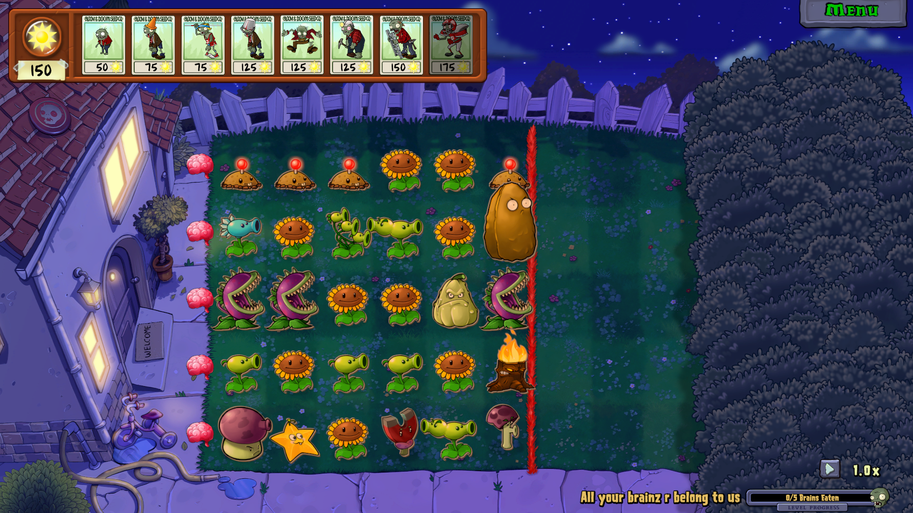

# مینی‌گیم‌ها {#minigames}

<!-- **مسئول: امین**

- در فاز فعلی، 3 تا 4 مینی‌گیم از بازی اصلی انتخاب و معرفی شوند.
- برای هر مینی‌گیم، قوانین، هدف و مکانیزم اصلی توضیح داده شود.
- در صورت سبک بودن بار پروژه، امکان افزودن مینی‌گیم‌های بیشتر در فاز بعدی در نظر گرفته شود. -->

مینی گیم ها مراحل اضافه‌تر هستند که از طریف 
travel log
قابل دسترسی اند. در 
travel log
یک صفحه مانند تصویر زیر وجود دارد که در آنها مینی‌گیم‌ها قرار می‌گیرند. از هر مینی گیم 3 مرحله باید پیاده سازی شود که هر یک از قبلی سخت‌تر است.

## Vasebreaker (کوزه شکنی) ❓

### معرفی مینی گیم

در این مینی گیم، هدف بازیکن این است که تمامی کوزه های چیده شده روی حیاط خودش را بشکند و هم زمان مراقب باشد که زامبی هایی که ممکن است درون کوزه بوده باشند، مغز او را نخورند.

### جزئیات پیاده سازی

در این مینی گیم، بازیکن گیاهان خودش را انتخاب نمی کند، همچنین خورشید از آسمان نمی افتد و تنها منبع تولید زامبی ها و گیاهان از کوزه هاست. هر کوزه می تواند یا خالی باشد، یا حاوی یک زامبی باشد و یا دارای یک Seed Packet یک بار مصرف برای یک گیاه باشد. لازم به ذکر است که Seed Packet های انداخته شده روی زمین پس از مدتی ناپدید می شوند و بازیکن باید سریعتر برای کاشتن آنها اقدام نماید.

#### کوزه های خاص

علاوه بر کوزه های عادی که صرفا دارای یک نماد علامت سوال هستند، دو نوع کوزه خاص هم داریم.

- کوزه گیاه: به صورت تضمینی یک Seed Packet تصادفی برای کاشت گیاه می دهد.
- کوزه غول: به صورت تضمینی یک غول  (Gargantuar) از آن خارج می شود.

دستورات مربوط به این مینی گیم (مانند شکستن کوزه یا برداشتن 
seed packet
افتاده از یک کوزه) را خودتان انتخاب کنید.

<!-- ## Save Our Seeds (S.O.S) 🌱

### معرفی مینی گیم

در این مینی گیم، روال بازی تقریبا بدون تغییر است به استثنای یک مورد، تعدادی گیاه از پیش مشخص شده روی حیاط قرار دارند (روی کاشی هایی که رنگ سیاه و زرد دارند قرار می گیرند) و اگر  حتی یکی از این گیاهان خورده یا نابود بشود، بازیکن مرحله را می بازد.

### جزئیات پیاده سازی

روند کلی بازی به طور عمومی حفظ شده و فقط این گیاهان مورد مراقبت به صفحه بازی افزوده می شوند، امکان برداشتن آنها با بیل هم ممکن نیست.

 -->

## Wallnut Bowling (بولینگ گردویی) 🎳

### معرفی مینی گیم

در این مینی گیم، بازیکن حق انختاب گیاهان خودش را ندارد و گیاهان از طریق نوار (Conveyor Belt) به بازیکن داده می شود. این گیاهان گردو هایی هستند که پس از کاشته شدن مانند توپ بولینگ به سمت زامبی ها می روند و به آنها برخورد کرده (برخورد ها باعث توقف گردو ها نمی شود و صرفا مسیرشان عوض می شود.) و به زامبی ها صدمه می زنند. بازیکن باید به کمک این گردو ها از پیشروی زامبی ها جلوگیری کند.

### جزئیات پیاده سازی

در این مینی گیم خورشید از آسمان نمی افتد و دو نوع گیاه خاص به بازیکن داده می شود. یک خط قرمز رنگ بر روی حیاط کشیده شده و بازیکن از درب خانه اش تا این خط قرمز حق کاشتن گیاه دارد.

#### معرفی گیاهان

- گردوی بولینگ (Bowling Wallnut): این یک گردو است که پس از کاشته شدن مانند توپ بولینگ در خطی مستقیم شروع به حرکت به سمت زامبی ها می کند. پس از برخورد به یک زامبی، به آن صدمه می زند و سپس مسیر آن ۴۵ درجه می چرخد. در برخورد های بعدی مسیر توپ ۹۰ درجه می چرخد. اگر گردو به بالا یا پایین صفحه برخورد کند نیز همین اتفاق می افتد.
- گردوی انفجاری (Explode O' Nut): این گردو رنگی قرمز مانند بمب گیلاسی (Cherry Bomb) دارد و ترکیبی از آن و گردوی معمولی است. پس از کاشته شدن در مسیری مسفتقیم حرکت کرده و پس از برخورد با اولین زامبی در راه خود، در یک محدوده ۳ در ۳ کاشی منفجر می شود و به اندازه بمب گیلاسی صدمه وارد می کند.
- گردوی بزرگ: پس از کاشته شدن، کاملا مستقیم حرکت می‌کند و هرگاه به زامبی‌ای برخورد کند، آن را له کرده و حرکت روبه‌جلوی خود را ادامه می‌دهد.

## i, zombie (من زامبی)

### معرفی مینی گیم

در این مینی‌گیم، تعدادی گیاه به صورت تصادفی در تعدادی از ستون‌های سمت چپ صفحه کاشته شده است، و جلوی آن گیاهان، یک خط قرمز وجود دارد. بازیکن باید در این مینی گیم، به جای گیاهان طرف زامبی‌ها است و باید با گذاشتن زامبی‌ها، گیاهان را شکست دهد. در تصویر زیر می‌توانید نمونه‌ای از آن را مشاهده کنید (توجه کنید که این اسکرین شات از 
plants vs. zombies 1
گرفته شده است و برای این است که ایده حدودی از خواسته پروژه داشته باشید، برای همین ممکن است بعضی گیاهان یا زامبی‌های این تصویر در پروژه وجود نداشته باشند)

### جزئیات پیاده سازی

بازیکن با خرج کردن خورشید (که در ابتدای مرحله 150 تا از آن را دارد) زامبی‌ها را در سمت راست خط قرمز بگذارد تا به گیاهان حمله کنند. زامبی‌ها با خوردن گل‌های آفتابگردان، تعدادی خورشید جمع‌آوری می‌کنند که با کمک آن بازیکن می‌تواند زامبی‌های بیشتری را در زمین قرار دهد. به جز این مورد، تعامل گیاهان با زامبی‌ها در این مینی‌گیم فرقی با بازی عادی ندارد. در انتهای هر ردیف از باغچه، یک مغز به جای 
lawn mower
وجود دارد که زامبی‌ها با رسیدن به آن مغز، آن را می‌توانند بخورند.
هرگاه تمام مغزهای هر 5 ردیف خورده شدند، بازیکن برنده می‌شود. اگر بازیکن خورشید کافی برای گذاشتن زامبی بیشتری نداشته باشد و تمام زامبی‌های موجود در صفحه از بین رفته باشند، بازیکن می‌بازد.

در هر مرحله، 5 زامبی برای بازیکن وجود دارد که با آنها مرحله را بازی کند. انتخاب اینکه کدام زامبی‌ها و با چه قیمتی برای بازیکن وجود داشته باشد به سلیقه خودتان است، ولی لازم است که مجموعا در تمام مراحل، 10 زامبی مختلف وجود داشته باشد. یعنی 5 زامبی موجود در هر مرحله نباید با 5 زامبی مرحله‌ای دیگر کاملا یکسان باشد.

## Beghouled (ترکیب سه‌تایی) -- امتیازی

### معرفی مینی گیم
در این مینی‌گیم، از ابتدای بازی، در کل زمین به صورت رندوم، پنج نوع گیاه کاشته شده است، و زامبی‌ها مثل یک مرحله عادی وارد زمین می‌شوند، فقط با این تفاوت که هیچگاه 
موج‌های زامبی‌ها تمام نمی‌شود.

در این مرحله، بازیکن باید با گیاهان را طوری جابه‌جا کند که یک ترکیب سه‌تایی (یا بیشتر) از گیاه یکسان در یک ستون یا یک ردیف تشکیل شود (تا حدی شبیه به بازی 
candy crush).

<video controls src="../../../assets/videos/Beghouled.mkv" title="Beghouled"></video>

هرگاه ترکیبی ساخته شود، گیاهان آن ترکیب از بین رفته و گیاهان بالای آنها پایین به جای آنها می‌افتند، و هرجا لازم باشد، گیاه به صورت تصادفی از بالا ساخته می‌شود.
 بازیکن وقتی برنده می‌شود که تعدادی معین ترکیب سه تایی (یا بیشتر) بسازد.

### جزئیات پیاده سازی

هرگاه که بازیکن یک ترکیب سه‌تایی ایجاد کند، یک خورشید 50 تایی می‌گیرد. با این خورشیدها، می‌تواند گیاهان موجود در زمین را ارتقا دهد (که درمورد جزئیات ارتقا در ادامه توضیح داده شده است).
اگر بتواند ترکیب را بیشتر از 3 تا کند، به ازای هر چه ترکیب بزرگتر است، یک خورشید بیشتر می‌گیرد (برای مثال ترکیب چهارتایی، دو خورشید می‌دهد و ترکیب پنج‌تایی، 3 خورشید می‌دهد).
همچنین اگر بازیکن حرکتی را انجام دهد و بعد از حرکت او، به خاطر تشکیل تصادفی گیاهان ترکیب 3 تایی جدیدی ایجاد شود، این ترکیب‌ها یکی خورشید بیشتر از حالت عادی خود می‌دهند.

هرگاه یک زامبی گیاهی را بخورد، در آنجا یک 
crater 
یا زمین خاکی ایجاد می‌شود و دیگر در آنجا گیاهی نمی‌تواند قرار بگیرد.

همانطور که در بالا گفته شد، شرط برد، ساخت تعدادی معین شده ترکیب سه تایی یا بیشتر است. این تعداد در هر مرحله بیشتر می‌شود. پس از رسیدن به تعداد مورد نظر ترکیب، تمام زامبی‌های موجود در باغ از بین رفته و بازیکن برنده می‌شود.

دستورات مربوط به جابجایی گیاهان و انتخاب ارتقا را به دلخواه خودتان انتخاب کنید.

#### انواع ارتقا

همانطور که در بالا گفته شد، می‌توان گیاهان را ارتقا داد. برای مثال، با خرج کردن 500 خورشید، باید بتوان تمام
peashooter
های موجود در باغ را به
repeater
تبدیل کرد. در پایین تعدادی ارتقای پیشنهادی را آورده‌ایم:

|هزینه (خورشید)|تبدیل به|تبدیل از|
|:-:|:-:|:-:|
|500|repeater|peashooter|
|1500|mega gatling-pea|repeater|
|500|tall-nut|wall-nut|
|250|fume-shroome|puff-shroom|
|1000|melon-pult|cabbage-pult|
|750|winter melon|melon-pult|

شما می‌توانید ارتقاهای بیشتر یا متفاوتی بگذارید، ولی لازم است حداقل یک ارتقای دو مرحله‌ای (مانند 
cabbage-pult
به
melon-pult
و ارتقای
melon-pult
به
winter melon)
و ارتقا برای سه گیاه متفاوت را پیاده سازی کنید.
انتخاب اینکه چه گیاهان و چه ارتقاهایی در هر مرحله وجود دارد نیز به عهده خودتان است، اما لازم است گیاهان هر مرحله و ارتقاهایشان کمی تفاوت داشته باشند.

## Whack a zombie (زامبی  را له کن) -- امتیازی

### معرفی مینی گیم

در این مینی‌گیم، تعدادی قبر در زمین وجود دارد، و در هر 
wave،
تعدادی زامبی از آن قبرها بیرون می‌آیند (هیچ زامبی‌ای از سمت راست وارد زمین بازی نمی‌شود).
بازیکن به جای گیاه، یک چکش دارد که می‌تواند روی زامبی‌ها بزند تا آنها را بکشد.
هرچه از بازی می‌گذرد، قبرهای بیشتری به صورت تصادفی در زمین ایجاد می‌شوند و زامبی‌های بیشتر و قوی‌تری از آنها بیرون می‌آیند، تا وقتی که در آخرین 
wave،
از تمام قبرها یک زامبی بیرون می‌آید، و با شکست دادن آنها، بازیکن برنده می‌شود.

### جزئیات پیاده سازی

در این مرحله، فقط سه نوع زامبی
brown coat
و
conehead
و 
buckethead
از قبرها بیرون می‌آیند. زامبی‌ عادی با یک ضربه چکش کشته می‌شود، 
conehead
با دو ضربه، و
buckethead
هم با سه ضربه کشته می‌شود.

تعدادی از زامبی‌ها ممکن است هنگام کشته شدن، 75 خورشید بدهند. بازیکن می‌تواند با خورشید های جمع‌آوری شده، از سه گیاهی که به آنها دسترسی دارد استفاده بکند.
این سه گیاه
potato mine
و 
grave buster
و
ice-shroom
هستند.

درصورتی که زامبی‌ها به خانه برسند، بازیکن می‌بازد، و در صورتی که آخرین 
wave
از زامبی‌ها را شکست دهد نیز برنده می‌شود.

دستور مربوط به چکش زدن در یک خانه خاص را به انتخاب خودتان انتخاب کنید.

## Zombotany (زامبی‌های گیاهی) -- امتیازی

### معرفی مینی گیم

این مینی گیم به این صورت است که زامبی‌ها خاصیت بعضی از گیاهان را دارند، برای مثال بعضی از زامبی‌ها مانند 
peashooter
به جلو تیر پرتاب می‌کنند که به گیاهان خورده و به آنها آسیب می‌زند. بقیه اجزای مرحله (از فرایند انتخاب گیاهان تا پیروزی/باخت) مانند یک مرحله عادی است.

### جزئیات پیاده سازی

لازم است که زامبی‌هایی که خواص گیاهان زیر را دارند را پیاده سازی کنید (زامبی‌های زیر، به جز خواص گفته شده، کاملا مانند زامبی‌ عادی هستند):

- تیرانداز (peashooter): زامبی مانند گیاه 
peashooter
به جلو تیر می‌زند و آن تیر به سمت چپ حرکت می‌کند تا به یک گیاه برخورد کند و به آن آسیب بزند.
- گردو (wall-nut): مانند گیاه گردو خیلی جان زیادی دارد، ولی مانند زامبی‌های معمولی سرعت پایینی دارد.
- فلفل (jalapeno): اگر بعد از گذشت ده ثانیه از زمان ورود به باغ نابود نشود، کل گیاهان ردیف خودش را آتش زده و از بین می‌برد.
- کدو (squash): خیلی سریع حرکت می‌کند و اگر به گیاهی برسد، هم خودش و هم آن گیاه را از بین می‌برد.

بقیه‌ی اجزای مرحله مانند یک مرحله معمولی است.