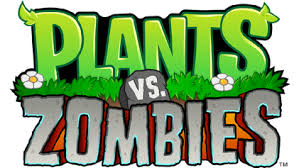
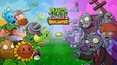
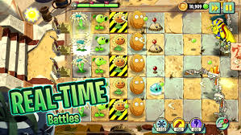

  <h2 dir="rtl">به نام خدا</h2>
  

  <h2 dir="rtl">درس برنامه‌‌نویسی پیشرفته</h2>
  <h3 dir="rtl">فاز صفر و یک</h3>

  

    <strong>دانشکده مهندسی کامپیوتر</strong> 
    <strong>دانشگاه صنعتی شریف</strong> 
    <strong>نیم‌سال دوم 05-04</strong>
  

   

  

    استاد: 
    <strong>دکتر محمد امین فضلی</strong>
  

   

  

    طراحان: 
    مهدی علی نژاد، عارف زارع زاده، پارسا ضمیری، امیرمهدی طهماسبی  
    علیرضا مهندسی، متین باقری، رهام قاسمی، محمدامین حقجو، یاسمن کاویانپور، حسین زاهدی ادیب، محمدپارسا آرانی، آرش شاه حسینی، امیرحسین مهبودی
  

# مقدمه

  

پروژه درس برنامه‌‌نویسی پیشرفته نسخه‌‌ای از بازی Plants vs. Zombies 2 خواهد بود.

در این بازی، بازیکن در یک دنیای خیالی و آخرالزمانی قرار دارد که توسط زامبی‌‌ها تصاحب شده است. مأموریت اصلی حفاظت از آخرین خطوط دفاعی انسان‌‌ها با استفاده از انواع گیاهان است. هر گیاه دارای توانایی‌‌های منحصربه‌‌فرد و اثرات ویژه‌‌ای است که بازیکن باید بر اساس نوع تهدید و شرایط مرحله‌‌ی بازی، استراتژی مناسبی را انتخاب کند.

  
  

# فهرست مطالب

- [مقدمه](sections/01-introduction.md#مقدمه)
- [فاز صفر](sections/01-introduction.md#فاز-صفر)
- [ثبت‌‌نام](sections/02-implementation.md#منوی-ثبتنام)
- [ورود](sections/02-implementation.md#منوی-ورود)
- [منوی اصلی](sections/02-implementation.md#منوی-اصلی)
- [منوی پروفایل](sections/02-implementation.md#منوی-پروفایل)
- [منوی بازی](sections/02-implementation.md#منوی-بازی)
- [منوی کلکسیون](sections/02-implementation.md#منوی-کلکسیون)
- [منوی تنظیمات](sections/02-implementation.md#منوی-تنظیمات)
- [منوی اخبار](sections/02-implementation.md#منوی-اخبار)
- [انتخاب گیاهان](sections/03-fixed-stage-mechanisms.md#منوی-انتخاب-گیاه)
- [مکانیزم‌‌های اصلی](sections/03-fixed-stage-mechanisms.md#مکانیزمهای-اصلی-بازی)
- [گیاهان](sections/04-plants-food-upgrades.md#گیاهان)
- [زامبی‌‌ها](sections/05-zombies-abilities.md#زامبیها)
- [فصل‌‌ها](sections/06-adventure-stages-bosses.md#فصلها)
- [گلخانه](sections/07-greenhouse-shop-settings.md#گلخانه)
- [فروشگاه](sections/07-greenhouse-shop-settings.md#فروشگاه)
- [کوئست‌‌ها](sections/08-quests.md#کوئستها)
- [بازی امتیازی](sections/09-leaderboard-scoring.md#بازی-امتیازی)
- [لیدربورد](sections/09-leaderboard-scoring.md#لیدربورد)
- [مینی‌‌گیم‌‌ها](sections/10-minigames.md#مینیگیمها)

