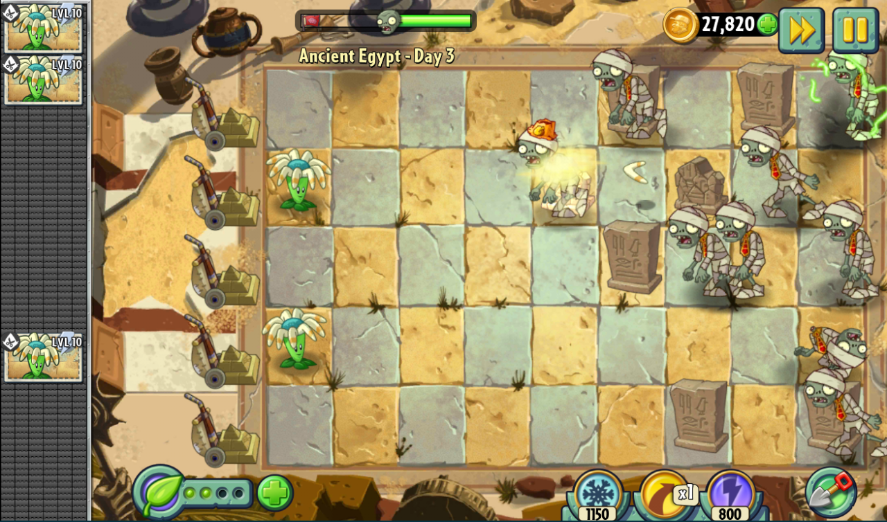
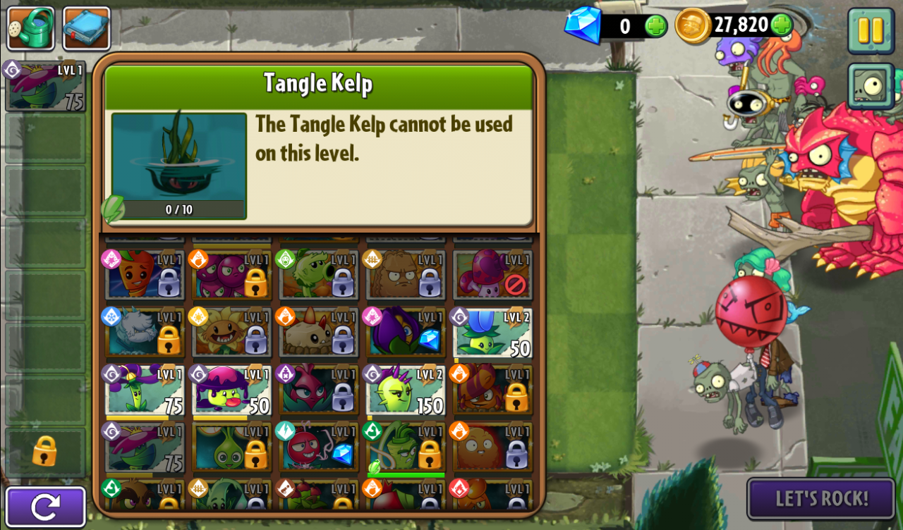
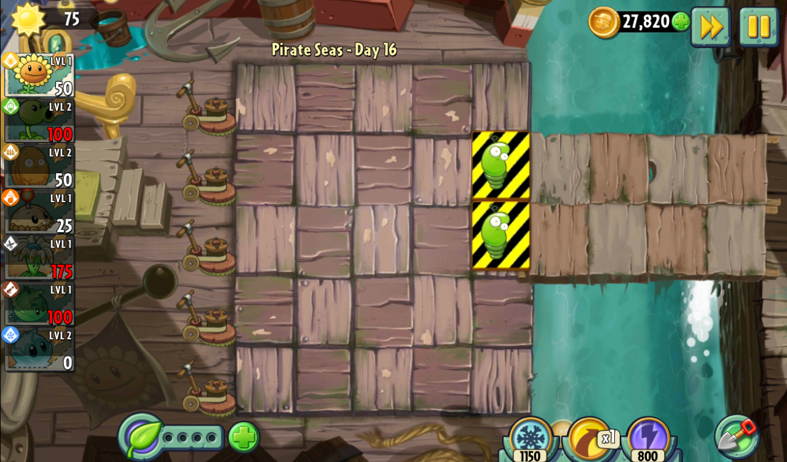
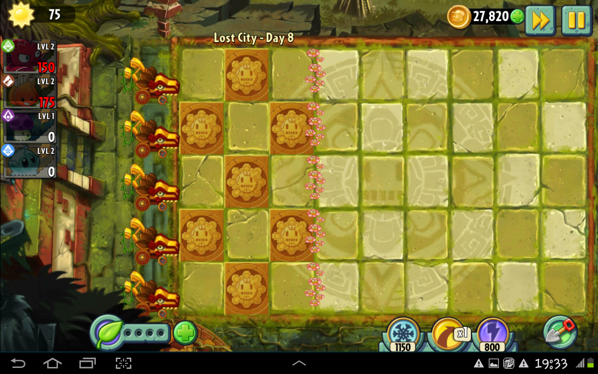


# فصل‌‌ها

## فصل‌‌های Adventure

بخش 
adventure
شامل چهار فصل می‌باشد که هر فصل دارای ۴ مرحله است. مرحله‌ی اول هر فصل یک مرحله‌ی معمولی است که توضیحات آن در بخش‌های قبل داده شده. دو مرحله‌ی بعدی فصل، مراحل ویژه هستند که در ادامه درباره‌شان توضیح داده خواهد شد (توجه شود که ۸ نوع مرحله‌ی ویژه داریم، پس هر یک از مراحل ویژه باید یک بار در 
adventure
دیده شوند).
مرحله آخر هر فصل‌ هم مرحله‌‌ی رئیس است که در فاز بعدی باید پیاده سازی کنید.
 <!-- مرحله آخر هر فصل نیز مرحله‌ی رئیس است که در ادامه درباره‌ی آن توضیح داده شده است. -->
 <!--Uncomment this line if there are boss stages in phase 1 !!!!!!!!!!!!!!!!!!!!!!!!!!!!!!!!!!!!!!!!!!!!!!!!!!!!!!!!!!!!!!!!!!!!!!!!!!!!!!!!!!!!!!!!!!!!!!!!!!!!!!!!!!!!!!!!!!!!!!!!!!!!!!!!!!!!!!!!!!!!!!!!!!!!!!!!!-->

هر فصل ویژگی‌های خاص خود را دارد. همچنین تعدادی از زامبی‌ها فقط در فصل‌های خاصی دیده می‌شوند که در بخش زامبی‌ها در این مورد توضیح داده شده است. در بخش زیر، هر یک از چهار فصل و ویژگی‌های آن توضیح داده شده اند:

### مصر باستان
این فصل نقش معرفی بازیکن به محیط بازی را دارد و فقط دارای دو ویژگی خاص است:

*قبر*:
در ابتدای هر مرحله، تعدادی قبر وجود دارد که مانع تیرهای مستقیم گیاهان می‌شوند. دارای جان 700 هستند و باید نابود شوند تا تیرهای مستقیم گیاهان بتوانند از آن خانه رد شوند.

*گردباد*:
زامبی‌ها ممکن است به جای اینکه به صورت عادی وارد نقشه شوند، با گردباد وارد شوند از لحظه ورود، بین 1 تا 4 ستون، جلوتر از چیزی که در حالت عادی رخ می‌دهد وارد شوند (فقط در موج آخر).

### غارهای یخی
در این فصل زامبی‌ها با تیر یخی گیاهان یخ نمی‌زنند. همچنین موارد زیر در این فصل وجود دارند:

*باد یخی*:
در هر موج از زامبی‌، ممکن است باد یخی به تعدادی از ردیف ها برخورد کند و کلیه گیاهان (به جز گیاهانی که تگ آتشین دارند) آن ردیف‌ها، یکی به سطح یخزدگی‌شان اضافه می‌شود. در کل سه سطح یخ زدگی وجود دارد که دو سطح اول هیچ کاری نمی‌کنند، و در سطح سوم گیاه به طور کامل یخ می‌زند.
گیاهان یخ زده تا زمانی که یخشان از بین نرود، هیچ کاری نمی‌کنند.
یخ روی گیاهان 600 تا سلامتی دارد و باید با تیر گیاهان نابود شود، یا با تیری آتشین بلافاصله از بین برود. همچنین اگر در یکی از 8 خانه اطراف گیاه یخ زده، گیاه آتشینی باشد، با نرخ 60 سلامتی بر ثانیه یخ آسیب می‌بیند.
توجه شود که زامبی شکارچی نیز مانند باد یخی، سطح یخ زدگی گیاهان را یکی بالا می‌رود و اثر هردو یکی است.

*زمین یخی*:
در بعضی مراحل این فصل، تعداد زمین لیز روی نقشه وجود دارد که دارای جهت هستند. این جهت از پیش تعیین شده است و در وسط مرحله تغییر نمی‌کند. زامبی‌ها با راه رفتن روی آن به ردیف بالایی یا پایینی (بسته به جهت زمین لیز) می‌روند. توجه شود که زامبی دودو سوار که از موانع پرواز می‌کرد، از زمین لیز نیز فرار می‌کند.

*زامبی یخ‌زده*
در ابتدای بعضی مراحل، تعدادی زامبی یخ زده وجود دارد که مانند گیاهان یخ زده هیچ کاری نمی‌کنند، و وقتی یخشان از بین برود به صورت عادی به حرکت خود ادامه می‌دهند.

### ساحل موج بزرگ

*موج آب*:
در مراحل این فصل، تعدادی از ستون‌های سمت راست صفحه دریا است. برای کاشت گیاه روی آن، ابتدا باید یک
lily pad
روی آب قرار داد. البته تعدادی از گیاهان را می‌توان به طور مستقیم روی آب کاشت که در بخش گیاهان ذکر شده است.

سطح آب در طول مرحله می‌تواند تغییر کند. برای مثال ممکن است در یک زمان فقط سه ستون سمت راست باشد، و در چند ثانیه بعد پنج ستون سمت راست را شامل شود. هرگاه که موجی از زامبی‌ می‌آید، سطح آب نیز تغییر می‌کند. یک خط افقی در هر مرحله وجود دارد که مشخص می‌کند سطح آب فقط تا این ستون بالا می‌آید. اگر سطح آب بالا بیاید و گیاهی که در حالت عادی نمی‌توان در آب کاشت روی آب قرار بگیرد، آن گیاه از بین می‌رود.

*ساحل‌های پست*:
تعدادی از خانه‌های زمین بازی، ممکن است ساحل پست باشند. در این صورت اگر آب روی آنها باشد، ممکن است زامبی‌هایی از زیر آن بیرون بیایند.

### قرون وسطی (عصر تاریکی)
اصلی‌ترین ویژگی این مراحل این است که شب است و از آسمان خورشید پایین نمی‌آید. پس تنها راه تولید خورشید، از گیاهان است.

*قبر*:
در این فصل نیز قبر نیز وجود دارد. یک تفاوت اصلی با این قبرها با قبرهای مصر باستان این است که در ابتدای هر موج زامبی ممکن است تعدادی قبر به صورت تصادفی به وجود بیاید (مگر آنکه در آن خانه گیاهی کاشته شده باشد). همچنین بعضی از قبرهای قرون وسطی دارای 50 خورشید یا یک غذای گیاه هستند. هنگام تشکیل هر قبر باید به بازیکن اطلاع داده شود و هنگام چاپ کردن نقشه، نوع این قبرها نیز مشخص شود.

*نکرومنسی*:
بعضی از خانه‌های نقشه، پتناسیل آن را دارند که در صورتی که قبر رویشان باشند، در ابتدای هر موج زامبی، یک زامبی از زیر آن قبر به وجود بیاورند.


<!-- # نبرد های رئیس

در انتهای هر چپتر از بخش ماجراجویی (adventure) به مرحله‌ی نبرد با رئیس زامبی‌ها یعنی Dr. Zomboss می‌رسیدیم. در هر کدام از این نبردها دکتر سوار بر ماشینی که ساخته‌ی دست خودش است به ما حمله می‌کند. این غول‌های مکانیکی با وجود داشتن توانایی‌های منحصربه‌فرد و ظاهر متفاوت، در اکثر ویژگی‌ها مشترک هستند.

### ویژگی های مشترک:

- هر zombot دو ردیف را اشغال کرده و در صورت شلیک به هر یک از دو ردیف به آن آسیب می رسد.
- اختراع دکتر زامبی توانایی پرش بین ردیف های مختلف را دارند که این کار در بازه های زمانی دلخواه می تواند صورت بگیرد.
- میزان جان zombot به سه قسمت تشکیل شده و در صورت پایان هر قسمت، برای مدتی بی تحرک و گیج باقی می ماند.
- همه زامبوت‌ها توانایی پرتاب اشیائی به سمت گیاهان را دارند که محل هدف قرار داده‌شده چند ثانیه قبل از برخورد نشانه‌گذاری می‌شود.
- غول‌ها توانایی تولید زامبی‌های مرتبط با چپتر خود را به تعداد و نوع دلخواه دارند. در هنگام تولید زامبی، زامبوت باید بی‌تحرک باقی بماند.
- علاوه بر تحرک به چپ و راست، zombot می تواند در مواقع مختلف به دو شکل جلو عقب نیز برود:
	1. جلو و عقب رفتن در محدوده‌ی ۳ موزاییک انتهایی که باعث له شدن گیاهان آن محدوده می‌شود و هر از گاهی در مدت زمان بازی رخ می‌دهد.
	2. جلو رفتن ناگهانی و تا انتهای زمین که باعث از بین رفتن تمام گیاهان ۲ ردیف مربوطه می‌شود و تنها یک بار و در یک‌سوم انتهایی جان ربات صورت می‌گیرد.

### معرفی اختصاصی zombot:

- #### غول مصر باستان(Sphinx-inator):
						![[Sphinx-inator.png|230]]
		این ربات هر پس از گذشت مدتی خاص یا کاهش میزان جانش به مقدار کافی ۲ موشک با فاصله ۶ ثانیه شلیک می‌کند که اگر در موزاییک هدف‌گیری‌شده گیاهی باشد، از بین می‌رود.

- #### غول ساحل:

     ![[Pirate Seas.png|248]]       
		 
		 
	این zombot به جای شلیک موشک در هر مرحله ۵ عدد ایمپ پرتاب می‌کند که در ردیف‌های دلخواه به صورت ۱ ۲ ۲ تقسیم می‌شوند. همچنین هنگامی که ربات برای تخریب کامل ۲ ردیف می‌خواهد به سمت جلو بیاید می‌توان با پرتاب توپ نارگیل تقویت‌شده آن را به عقب راند تا چنین اتفاقی نیفتد.

- #### غول غارهای یخی:
				![[War Wagon.png|353]]

		وار واگن در هر بار شلیک خود ۴ نقطه از یک ردیف دارای گلدان متحرک را هدف قرار می‌دهد.


- #### غول قرون وسطی(Dark Dragon):
				![[Dark Dragon.png|383]]
	این Zombot مقداری از لحاظ ظاهری با قبلی ها متفاوت است اما در نهایت عملکرد مشابهی دارد.
	برای مثال به جای حرکت تا انتهای زمین در حرکت جلو و عقب که منجر به نابودی ۲ ردیف می‌شد، از دهان خود آتش خارج می‌کند و علاوه بر نابودی گیاهان ۲ ردیف، تا ۴ ثانیه نیز اجازه‌ی کاشت گیاه جدید را نمی‌دهد. همچنین در مرحله‌ی پرتاب اشیا نیز هدف گلوله‌های آتشی که پرتاب می‌شوند تا لحظه‌ی برخورد مشخص نیست و این خانه‌ها نیز تا ۴ ثانیه قابل کاشت مجدد نیستند.

--- -->

<div style="page-break-after: always;"></div>

# مراحل ویژه (Special Levels)

به جز مراحل عادی بازی، بعضی مراحل ویژه نیز باید پیاده‌سازی شوند. این مراحل به صورت خاص بازیکن را محدود می‌کنند تا با انجام یک سری وظیفه مشخص، مرحله را به پایان برساند.

## معرفی مراحل ویژه:

### 1. نوار کناری (Conveyor Belt Level)
<!-- امتیازی -->
<!-- <div style="background-color: #fffacd; border-right: 5px solid #ffcc00; padding: 15px; margin: 15px 0; border-radius: 4px; direction: rtl;"> -->

<!-- <strong style="color: #ff9800; font-size: 1.1em;">⭐ بخش امتیازیی</strong> -->

<div style="position: relative; display: flex; justify-content: center; align-items: center; margin: 20px auto;">
	
</div>

در این مرحله به جای قسمت انتخاب گیاه، بازیکن مستقیم وارد بازی می‌شود و نوار (تسمه نقاله‌ای) را در گوشه صفحه مشاهده می‌کند. این نوار هر **۱۲ ثانیه** یک گیاه را به صورت تصادفی (از بین گیاه‌های مخصوصی که بازیکن موفق به دریافت آن شده، بدون نیاز به انتخاب آن‌ها) بالا می‌آورد. دقت شود که اولین گیاه در لحظه ورود بازیکن به مرحله تولید می‌شود.

<!-- </div> -->
---

### 2. گیاهان زندانی (Locked Plants Level)

<div style="position: relative; display: flex; justify-content: center; align-items: center; margin: 20px auto;">
	
</div>

در این نوع مرحله، تعدادی از اسلات‌های انتخاب گیاه از ابتدا قفل شده‌اند یا بعضی گیاهان خاص به طور کلی در این مرحله در دسترس نیستند.
- در نوع اول از یک بعضی خانواده‌ها یک گیاه برداشته می‌شود و باقی آن خانواده قفل می‌شوند.
- در نوع دیگر چند گیاه برای بازیکن قفل هستند و بازیکن مجبور است با آن ها بازی را شروع کند.

---

### 3. محافظ دانه ها (Save Our Seeds)

<div style="position: relative; display: flex; justify-content: center; align-items: center; margin: 20px auto;">
	
</div>

چندین گیاه خاص از قبل روی نقشه قرار دارند. هر زامبی که موفق شود یکی از آن گیاهان را بخورد، بازیکن بلافاصله مرحله را می‌بازد.
به طور کلی یک خط قرمز یا علامت هشدار روی ردیف آن گیاه وجود دارد که بازیکن باید تمام تمرکز خود را روی دفاع از آن نقاط خاص بگذارید.

---

### 4. نبرد زماندار (Timed War)

در این مرحله یک تایمر در بالای صفحه نمایش داده می‌شود. بازیکن باید تا پایان تایمر تعداد مشخص‌شده‌ای از زامبی‌ها را از بین ببرد؛ مثلا ۱۲ زامبی در ۵ ثانیه.
در نوع دیگر بازیکن باید در زمان معلوم شده، تعدادی مشخص خورشید تولید کند.

---

### 5. شب عملیات (Night Ops)

مشابه شب در PVZ کلاسیک، هیچ آفتابی از آسمان نمی‌بارد. بازیکن فقط با آفتاب تولیدشده توسط گیاهان (مثل گل آفتاب‌گردان) می‌تواند زنده بماند.

---

### 6. ددلاین (Dead Line)

<div style="position: relative; display: flex; justify-content: center; align-items: center; margin: 20px auto;">
	
</div>

در این مراحل، یک خط عمودی در جای مشخصی از نقشه بازی وجود دارد. بازیکن به محض عبور هر زامبی از این خط، بلافاصله بازی را می‌بازد.

---

### 7. از دست نده (Love Your Plants)

اگر تعداد مشخصی از گیاهان، مثلا ۵ عدد، از بین بروند یا توسط زامبی‌ها خورده شوند، بازیکن بازی را می‌بازد.

---

<!-- <div style="background-color: #fffacd; border-right: 5px solid #ffcc00; padding: 15px; margin: 15px 0; border-radius: 4px; direction: rtl;"> -->

### 8. هر چه رسد بکار (Plant What You Get)

بازی با مقدار مشخصی **آفتاب اولیه** (مثلاً ۵۰۰ یا ۸۰۰) شروع می‌شود و دیگر هیچ آفتابی از آسمان نمی‌بارد. همچنین بازیکن امکان انتخاب گل‌های آفتابگردان را ندارد. بازیکن فقط با همان آفتاب اولیه باید تمام زامبی‌های مرحله را شکست دهد.

در ابتدای مرحله‌، زامبی‌ای وارد باغ نمی‌شود و بازیکن می‌تواند بدون اینکه از زمان 
recharge
گیاهان استفاده شود، هرچقدر که بخواهد گیاه بکارد، سپس می‌تواند با دستور
```
start zombie waves
```
کاری کند که زامبی‌ها بیایند و بازی به روند عادی شروع شود. البته می‌توانید مکانیزم شروع مرحله و باقی جزئیات را به انتخاب خودتان تغییر دهید، اما فرایند کلی باید به همین صورت باشد.

<!-- </div> -->


