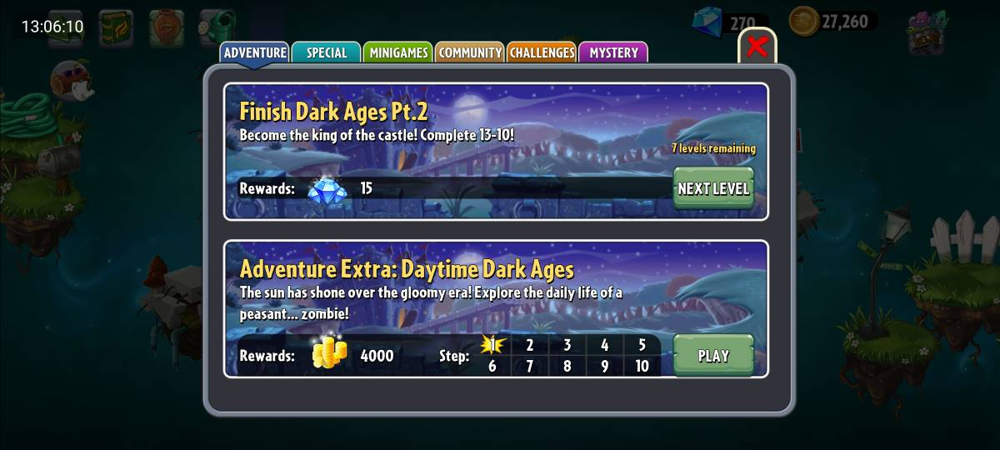



# کوئست‌‌ها


<div style="position: relative; display: flex; justify-content: center; align-items: center; margin: 20px auto;">
	
</div>

در این بخش مأموریت‌های مختلف بازی برای درگیر شدن بیشتر کاربر با بازی و هدایت کاربر در روند بازی است. کوئست‌ها به چهار دسته‌ی کلی تقسیم می‌شوند که هر کدام شرط کامل شدن و پاداش مخصوص به خودشان را دارند که در جدول زیر قید شده‌اند.

همانطور که در تصویر بالا می‌تواند دید، کوئست‌ها در منوی
travel log
قرار دارند، و با توجه به دسته‌بندی‌شان، در یک صفحه متفاوت در 
travel log
قرار می‌گیرند. برای تغییر در صفحه
travel log
از دستور زیر استفاده می‌شود:

```
travel log page <page_name>
```

همچنین صفحه مینی‌گیم در 
travel log
وجود دارد که در آن مینی‌گیم‌هایی که در ادامه توضیح داده می‌شوند وجود دارند.

[Quests-pvz2](https://my.sharif.edu/s/nndNcHm6By5yYbk)


## اولویت‌بندی و مکانیزم تعاملی
--

برای بالا بردن User Engagement، سیستم کوئست‌ها بر اساس اولویت‌های زیر نمایش داده می‌شوند:

- اولویت بحرانی (critical): کوئست‌های داستانی و باز کردن گیاهان جدید که پیشرفت کاربر به آن‌ها وابسته است و همیشه در صدر لیست هستند.
- اولویت بالا (High): چالش‌های Epic که پاداش الماس دارند. این الماس‌ها برای خرید قابلیت‌های ویژه ضروری هستند.
- اولویت متوسط و کم: کوئست‌های روزانه و تکرارپذیر که هدف آن‌ها تشویق کاربر به ورود روزانه به بازی است.
-ساختار فنی پاداش ها (Reward Logic)
--
پاداش ها در بازی به سه صورت زیر هستند:
- Currency: افزایش مقدار Coins یا Gems در پروفایل کاربر
- Unlockable: تغییر وضعیت یک گیاه یا مرحله از Locked به Available.
- Inventory: اضافه کردن آیتم های مصرفی مثل بسته های بذر به انبار کاربر


